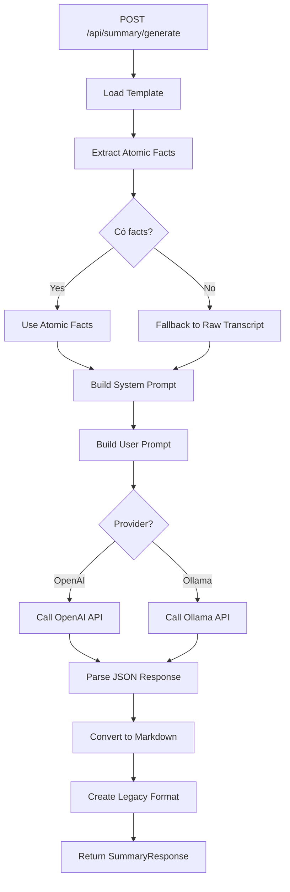
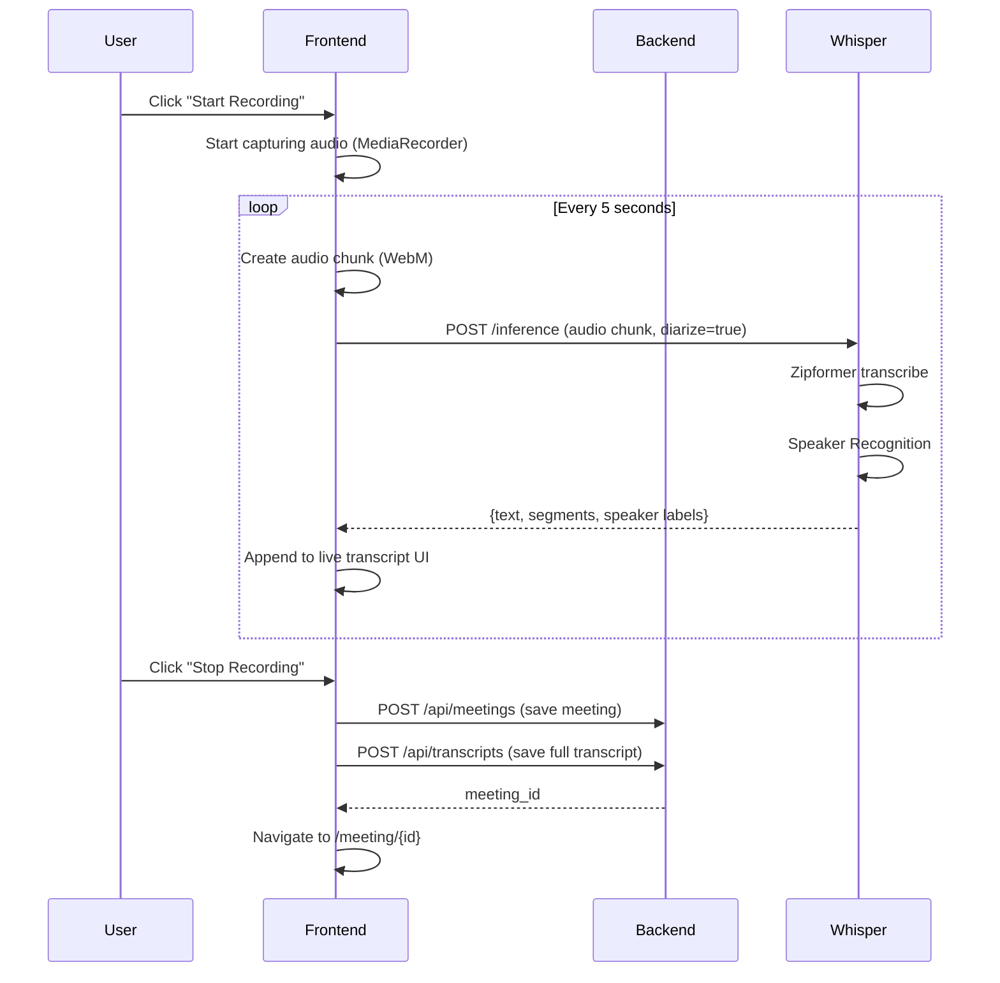
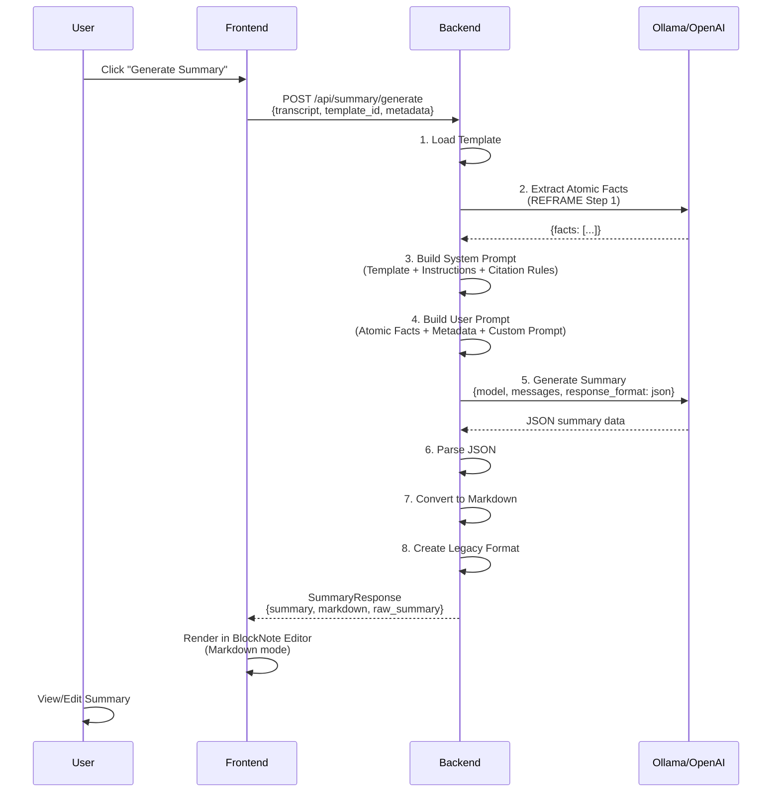
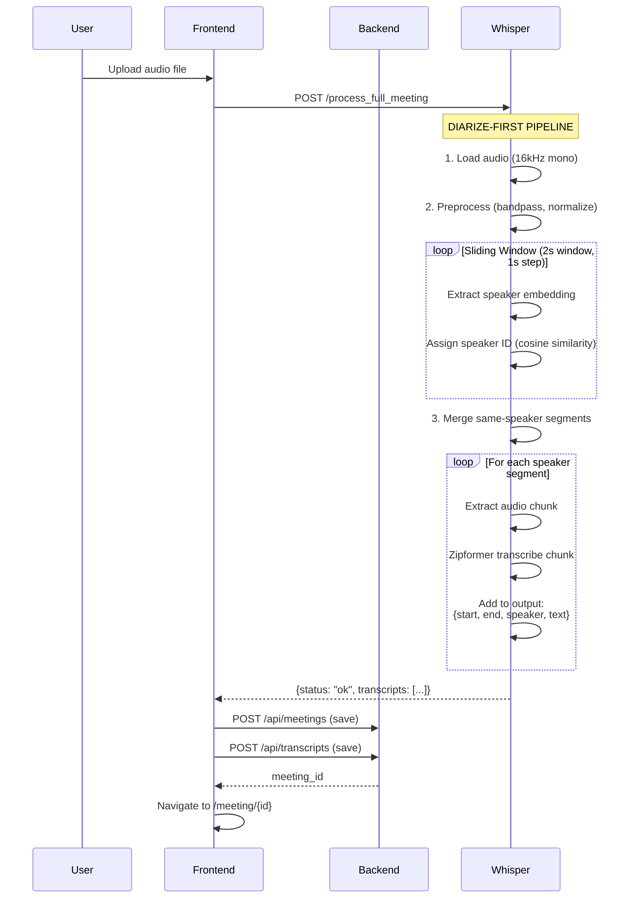

# HỆ THỐNG MEETILY-LITE - HƯỚNG DẪN CHI TIẾT

## 📋 MỤC LỤC
1. [Tổng quan hệ thống](#1-tổng-quan-hệ-thống)
2. [Cách chạy hệ thống](#2-cách-chạy-hệ-thống)
3. [Kiến trúc hệ thống](#3-kiến-trúc-hệ-thống)
4. [Phần Whisper Service - Model Transcripts](#4-phần-whisper-service---model-transcripts)
5. [Phần Backend - Logic Summary](#5-phần-backend---logic-summary)
6. [Luồng dữ liệu hoàn chỉnh](#6-luồng-dữ-liệu-hoàn-chỉnh)

---

## 1. TỔNG QUAN HỆ THỐNG

**Meetily-Lite** là một ứng dụng web tạo biên bản họp tự động từ audio recording, bao gồm 3 thành phần chính:

```
┌─────────────────┐
│   FRONTEND      │  Next.js (React) - Giao diện người dùng
│   Port: 3000    │
└────────┬────────┘
         │
         ▼
┌─────────────────┐
│   BACKEND       │  FastAPI - API endpoints, Logic tổng hợp
│   Port: 5167    │
└────────┬────────┘
         │
         ▼
┌─────────────────┐
│ WHISPER SERVICE │  FastAPI - STT (Speech-to-Text) + Diarization
│   Port: 8178    │  Model: Zipformer-70k, 3D-Speaker ERes2Net
└─────────────────┘
```

---

## 2. CÁCH CHẠY HỆ THỐNG

### Bước 1: Khởi động Whisper Service (STT + Diarization)
```powershell
cd D:\viettel\meeting-minutes\meeting-minutes\web-version\meetily-lite\whisper
python .\service.py
```
**Chức năng:**
- Load model Zipformer (STT) - Sherpa-ONNX
- Load model 3D-Speaker (Speaker Recognition)
- Lắng nghe tại `http://0.0.0.0:8178`

### Bước 2: Khởi động Backend API
```powershell
cd D:\viettel\meeting-minutes\meeting-minutes\web-version\meetily-lite\backend
python .\main.py
```
**Chức năng:**
- Khởi động FastAPI server với các router:
  - `/api/audio` - Upload audio files
  - `/api/diarization` - Speaker diarization
  - `/api/summary` - **TẠO BIÊN BẢN HỌP** (Trọng tâm!)
  - `/api/meetings` - Quản lý cuộc họp
  - `/api/transcripts` - Quản lý transcripts
  - WebSocket - Real-time live transcription
- Lắng nghe tại `http://0.0.0.0:5167`

### Bước 3: Khởi động Frontend
```powershell
cd D:\viettel\meeting-minutes\meeting-minutes\web-version\meetily-lite\frontend
npm run dev
```
**Chức năng:**
- Next.js dev server
- Giao diện web tại `http://localhost:3000`

---

## 3. KIẾN TRÚC HỆ THỐNG

### 3.1 Frontend (Next.js)
```
frontend/
├── src/
│   ├── app/
│   │   ├── page.tsx              # Trang chủ - danh sách meetings
│   │   ├── meeting/[id]/         # Chi tiết meeting + Summary viewer
│   │   └── notes/[id]/           # Ghi chú meeting
│   ├── components/
│   │   ├── AISummary/
│   │   │   └── BlockNoteSummaryView.tsx  # Hiển thị summary (BlockNote editor)
│   │   ├── AudioRecorder/        # Thu âm real-time
│   │   └── LiveTranscriptPanel/  # Hiển thị transcript live
│   └── lib/
│       └── api.ts                # API client (gọi backend)
└── package.json
```

### 3.2 Backend (FastAPI)
```
backend/
├── main.py                       # Entry point
├── app/
│   ├── summary.py                # ⭐ LOGIC TẠO BIÊN BẢN - QUAN TRỌNG NHẤT
│   ├── audio.py                  # Upload/xử lý audio
│   ├── diarization.py            # Phân tách speaker
│   ├── meetings.py               # CRUD meetings
│   ├── transcripts.py            # CRUD transcripts
│   ├── websocket_routes.py       # WebSocket cho live transcription
│   ├── templates/
│   │   └── bien_ban_hop_vn.json  # ⭐ TEMPLATE BIÊN BẢN (cấu trúc output)
│   └── database.py               # SQLite database
└── requirements.txt
```

### 3.3 Whisper Service (Speech Recognition)
```
whisper/
└── service.py                    # ⭐ MODEL TRANSCRIPTS - TRỌNG TÂM
```

---

## 4. PHẦN WHISPER SERVICE - MODEL TRANSCRIPTS

### 4.1 Models được sử dụng

#### A. **Zipformer-70k** (Speech-to-Text)
- **Library:** Sherpa-ONNX (Offline recognizer)
- **Đường dẫn model:** `models/zipformer/` hoặc `%APPDATA%/com.meetily.ai/models/zipformer/`
- **Files cần thiết:**
  - `encoder*.onnx`
  - `decoder*.onnx`
  - `joiner*.onnx`
  - `tokens.txt`
- **Chế độ:** Greedy search decoding
- **Provider:** CUDA (GPU) → fallback CPU nếu không có
- **Sample rate:** 16,000 Hz

**Code khởi tạo (service.py, dòng 105-158):**
```python
class ZipformerEngine:
    def load(self):
        import sherpa_onnx
        
        # Try CUDA first, fallback to CPU
        self.recognizer = sherpa_onnx.OfflineRecognizer.from_transducer(
            encoder=encoder,
            decoder=decoder,
            joiner=joiner,
            tokens=tokens,
            num_threads=4,
            sample_rate=16000,
            feature_dim=80,
            decoding_method="greedy_search",
            provider="cuda"  # or "cpu"
        )
```

#### B. **3D-Speaker ERes2Net** (Speaker Recognition/Diarization)
- **Library:** Sherpa-ONNX Speaker Embedding Extractor
- **Model file:** `3dspeaker_speech_eres2net_base_sv_zh-cn_3dspeaker_16k.onnx`
- **Threshold:** 0.45 (similarity threshold để nhận diện cùng người nói)
- **Chức năng:**
  - Extract speaker embedding (vector 192 chiều)
  - So sánh cosine similarity giữa các embedding
  - Gán label `SPEAKER_00`, `SPEAKER_01`, ...

**Code khởi tạo (service.py, dòng 288-336):**
```python
class SpeakerManager:
    def __init__(self, threshold=0.45):
        self.threshold = 0.45
        self.registry = {}  # Lưu trữ speaker embeddings
        self.next_id = 0
        
    def load(self):
        config = sherpa_onnx.SpeakerEmbeddingExtractorConfig(
            model=self.model_path,
            num_threads=2,
            provider="cpu"
        )
        self.extractor = sherpa_onnx.SpeakerEmbeddingExtractor(config)
```

### 4.2 Quy trình Transcription (API: `/inference`)

**Endpoint:** `POST http://0.0.0.0:8178/inference`

**Input:**
```http
Content-Type: multipart/form-data

file: <audio_file>
diarize: "true"
```

**Quy trình (service.py, dòng 414-491):**

```mermaid
graph TD
    A[Upload Audio] --> B{Load Audio}
    B --> C[Resample to 16kHz if needed]
    C --> D[Zipformer Transcribe]
    D --> E{Segments created?}
    E -->|Yes| F[For each segment]
    E -->|No| G[Use full audio as 1 segment]
    F --> H[Extract audio chunk by timestamp]
    H --> I{Filter trash?}
    I -->|Yes - skip| F
    I -->|No| J[Speaker Recognition]
    J --> K[Assign SPEAKER_XX label]
    K --> L[Format: '[SPEAKER_XX]: text']
    G --> M[Return result]
    L --> M
```

**Chi tiết từng bước:**

#### Bước 1: Load & Preprocess Audio
```python
# service.py, dòng 426-427
audio_data = await file.read()
audio_file = io.BytesIO(audio_data)

# Load audio robustly (soundfile or librosa)
audio, sr = load_audio_robust(audio_file)

# Convert to mono if stereo
if len(audio.shape) > 1:
    audio = audio.mean(axis=1)

# Resample to 16kHz
if sr != 16000:
    audio = librosa.resample(audio, orig_sr=sr, target_sr=16000)
```

#### Bước 2: Speech-to-Text (Zipformer)
```python
# service.py, dòng 430-431
engine = engines["zipformer"]
result = engine.transcribe(audio_file)
# result = {
#     "text": "Toàn bộ transcript...",
#     "segments": [
#         {"start": 0.0, "end": 2.5, "text": "Xin chào các em"},
#         {"start": 2.8, "end": 5.3, "text": "Hôm nay chúng ta..."}
#     ],
#     "total_ms": 1234.5,
#     "device": "sherpa-onnx",
#     "model": "Zipformer-70k"
# }
```

**Cách Zipformer tạo segments (service.py, dòng 193-243):**
- Trích xuất timestamps từ token-level
- Chia segment dựa trên:
  - Gap giữa tokens > 0.35s → split
  - Duration > 2.5s và gap > 0.15s → split
  - Duration > 7.0s và gap > 0.05s → split

#### Bước 3: Speaker Diarization (nếu `diarize=true`)
```python
# service.py, dòng 438-483
if do_diarize:
    for seg in segments:
        start_sample = int(seg['start'] * 16000)
        end_sample = int(seg['end'] * 16000)
        segment_audio = audio[start_sample:end_sample]
        
        # TRASH FILTER (bỏ qua trash speech)
        text_upper = seg['text'].strip().upper()
        blacklist = ["Ừ", "À", "ẬM", "Ờ", "UM", "UH", "AH", "A", "O"]
        if text_upper in blacklist or len(seg['text']) < 2:
            continue  # Skip trash
        
        # Speaker Recognition
        speaker_label = speaker_manager.identify(segment_audio)
        # speaker_label = "SPEAKER_00", "SPEAKER_01", ...
        
        seg['speaker'] = speaker_label
        formatted_parts.append(f"[{speaker_label}]: {seg['text']}")
    
    result['text'] = " ".join(formatted_parts)
```

**Cách Speaker Recognition hoạt động (service.py, dòng 338-401):**
```python
def identify(self, audio_samples, sample_rate=16000):
    # 1. Extract embedding (vector 192 chiều)
    stream = self.extractor.create_stream()
    stream.accept_waveform(sample_rate, audio_samples)
    embedding = self.extractor.compute(stream)
    embedding = np.array(embedding)
    
    # 2. Normalize
    norm = np.linalg.norm(embedding)
    if norm > 0:
        embedding /= norm
    
    # 3. Compare với tất cả speakers đã lưu
    best_score = -1
    best_id = -1
    for pid, data in self.registry.items():
        score = np.dot(embedding, data['centroid'])  # Cosine similarity
        
        # Temporal bias (ưu tiên speaker vừa nói gần đây)
        if pid == self.last_speaker_id and (current_time - self.last_speaker_time) < 3.0:
            score += 0.1
        
        if score > best_score:
            best_score = score
            best_id = pid
    
    # 4. Decision
    if best_score > self.threshold:  # 0.45
        # Cùng speaker → Update centroid (moving average)
        final_id = best_id
        alpha = 0.95
        new_centroid = alpha * old_centroid + (1 - alpha) * embedding
        self.registry[best_id]['centroid'] = new_centroid / norm
    else:
        # New speaker
        final_id = self.next_id
        self.registry[final_id] = {'centroid': embedding, 'count': 1}
        self.next_id += 1
    
    return f"SPEAKER_{final_id:02d}"
```

#### Output mẫu:
```json
{
  "text": "[SPEAKER_00]: Xin chào các em [SPEAKER_01]: Chào thầy ạ [SPEAKER_00]: Hôm nay chúng ta sẽ bàn về dự án mới",
  "segments": [
    {"start": 0.0, "end": 2.5, "text": "Xin chào các em", "speaker": "SPEAKER_00"},
    {"start": 2.8, "end": 4.3, "text": "Chào thầy ạ", "speaker": "SPEAKER_01"},
    {"start": 5.0, "end": 8.5, "text": "Hôm nay chúng ta sẽ bàn về dự án mới", "speaker": "SPEAKER_00"}
  ],
  "total_ms": 1234.5,
  "device": "sherpa-onnx",
  "model": "Zipformer-70k"
}
```

---

## 5. PHẦN BACKEND - LOGIC SUMMARY

### 5.1 Template Biên bản họp

**File:** `backend/app/templates/bien_ban_hop_vn.json`

**Cấu trúc:**
```json
{
  "name": "Biên bản họp (Vietnamese)",
  "description": "Template biên bản họp chuyên nghiệp...",
  "sections": [
    {
      "title": "Thông tin chung",
      "instruction": "Sử dụng thông tin từ phần 'THÔNG TIN CUỘC HỌP'...",
      "format": "paragraph"
    },
    {
      "title": "Thành phần tham dự",
      "instruction": "Liệt kê danh sách người tham gia...",
      "format": "list",
      "item_format": "| **Tên/Label** | **Chức vụ/Vai trò** | **Ghi chú** |"
    },
    {
      "title": "Các quyết định quan trọng (Decisions)",
      "instruction": "Liệt kê các quyết định đã được CHỐT...",
      "format": "list",
      "item_format": "| **Nội dung quyết định** | **Người phê duyệt/Chốt** | **Tham chiếu** |"
    },
    {
      "title": "Kế hoạch hành động (Action Items)",
      "instruction": "Danh sách công việc cần làm sau cuộc họp...",
      "format": "list",
      "item_format": "| **Nhiệm vụ** | **Người phụ trách** | **Deadline** | **Trạng thái** |"
    }
    // ... 8 sections tổng cộng
  ]
}
```

**Các section chính:**
1. **Thông tin chung** - Thời gian, địa điểm, chủ trì
2. **Thành phần tham dự** - Danh sách người tham gia (table)
3. **Mục tiêu cuộc họp** - Lý do tổ chức
4. **Tóm tắt điều hành** - Executive summary (< 150 từ)
5. **Nội dung thảo luận chi tiết** - Diễn biến cuộc họp theo chủ đề
6. **Các quyết định quan trọng** - Decisions đã chốt (table)
7. **Kế hoạch hành động** - Action items (table với deadline)
8. **Ý kiến tồn đọng/Rủi ro** - Vấn đề chưa giải quyết (table)

### 5.2 Quy trình Tạo Summary - REFRAME Methodology

**Endpoint:** `POST http://0.0.0.0:5167/api/summary/generate`

**Input:**
```json
{
  "transcript": "[SPEAKER_00]: Xin chào... [SPEAKER_01]: ...",
  "template_id": "bien_ban_hop_vn",
  "provider": "ollama",  // hoặc "openai"
  "model": "gemma2:2b",  // hoặc "gpt-4o-mini"
  "metadata": {
    "meeting_title": "Họp dự án Q1",
    "date": "2026-01-26",
    "participants": ["Nguyễn Văn A", "Trần Thị B"]
  },
  "custom_prompt": "Tập trung vào các quyết định về ngân sách"
}
```

#### Quy trình (summary.py, dòng 651-783)



#### Bước 1: Extract Atomic Facts (REFRAME/FRAME Methodology)

**Mục đích:** Chống hallucination bằng cách:
1. Chia transcript thành các **atomic facts** (sự kiện nguyên tử - không chia nhỏ được nữa)
2. Mỗi fact có **context** và **verbose_context** để hiểu đúng ý nghĩa
3. **Grounding** - đảm bảo mọi thông tin đều có nguồn gốc từ transcript

**Code (summary.py, dòng 274-436):**
```python
async def extract_atomic_facts(transcript, provider, model, api_key):
    system_prompt = """Bạn là chuyên gia phân tách transcript thành atomic facts.
    
    QUY TẮC:
    1. Output phải là JSON list of objects
    2. KHÔNG BAO GIỜ thêm thông tin không có trong transcript
    3. Bỏ qua nội dung không rõ ràng
    4. Mỗi fact phải atomic (1 piece of info)
    5. KHÔNG hallucination hoặc suy luận
    
    INCLUDE only:
    - Clear, explicit statements
    - Actionable items or decisions
    - Important discussion points
    - Concrete facts
    
    EXCLUDE:
    - Filler ("OK", "Right", "Mm-hmm")
    - General acknowledgments
    - Incomplete statements
    - Transcription artifacts
    
    Output Format:
    {
      "facts": [
        {
          "fact": "Clear atomic statement",
          "context": "Immediate context",
          "verbose_context": "Comprehensive context",
          "timestamp": "Start time in seconds or [MM:SS]",
          "citation": "[MM:SS] format"
        }
      ]
    }
    """
    
    user_prompt = f"""
    Break down this transcript chunk into atomic facts with context.
    
    Current chunk:
    {transcript}
    
    Provide output as PURE JSON (no markdown).
    """
    
    # Call LLM (OpenAI or Ollama)
    if provider == "openai":
        response = await client.chat.completions.create(
            model=model,
            messages=[
                {"role": "system", "content": system_prompt},
                {"role": "user", "content": user_prompt}
            ],
            response_format={"type": "json_object"},
            temperature=0.1  # Low temperature for factual extraction
        )
        content = response.choices[0].message.content
    else:  # Ollama
        response = await client.post(OLLAMA_API_URL, json={
            "model": model,
            "prompt": user_prompt,
            "system": system_prompt,
            "format": "json",
            "options": {"temperature": 0.1}
        })
        content = response.json()["response"]
    
    # Parse JSON
    parsed = json.loads(content)
    facts = parsed.get("facts", [])
    
    # Filter valid facts
    valid_facts = [f for f in facts if isinstance(f, dict) and "fact" in f and f["fact"]]
    
    return valid_facts
```

**Output mẫu:**
```json
{
  "facts": [
    {
      "fact": "Dự án phải hoàn thành trước ngày 15/02/2026",
      "context": "Thảo luận về deadline dự án Q1",
      "verbose_context": "Team đang review tiến độ dự án Q1, và chủ trì đã đưa ra quyết định về deadline cuối cùng",
      "timestamp": 125.5,
      "citation": "[02:05]"
    },
    {
      "fact": "Nguyễn Văn A được phân công làm team lead",
      "context": "Quyết định về nhân sự dự án",
      "verbose_context": "Sau khi thảo luận về năng lực và kinh nghiệm, chủ trì quyết định bổ nhiệm Nguyễn Văn A làm team lead",
      "timestamp": 245.2,
      "citation": "[04:05]"
    }
  ]
}
```

#### Bước 2: Build System Prompt (Inspired by Desktop App's Pydantic)

**Code (summary.py, dòng 677-725):**
```python
# Inject metadata context
metadata_context = ""
if request.metadata:
    metadata_context = f"""
THÔNG TIN CUỘC HỌP (SỬ DỤNG CHO PHẦN THÔNG TIN CHUNG):
- Tiêu đề: {request.metadata.get('meeting_title', 'Không xác định')}
- Thời gian: {request.metadata.get('date', 'Không xác định')}
- Danh sách tham dự: {', '.join(request.metadata.get('participants', []))}
"""

system_prompt = f"""Bạn là một thư ký cuộc họp chuyên nghiệp. Nhiệm vụ là tạo biên bản họp CHẤT LƯỢNG CAO từ danh sách "Atomic Facts" (Sự kiện đã xác thực).

{metadata_context}

CẤU TRÚC TEMPLATE:
{json.dumps(template, ensure_ascii=False, indent=2)}

HƯỚNG DẪN CHI TIẾT:"""

# Inject instructions from template
for section in template.get("sections", []):
    system_prompt += f"\n- **{section['title']}**: {section['instruction']}"

system_prompt += f"""

ĐỊNH DẠNG OUTPUT JSON:
{{
  "Section Title 1": <content>,
  "Section Title 2": <content>,
  ...
}}

QUY TẮC NỘI DUNG:
- Content có thể là STRING (paragraph) hoặc ARRAY (list items)
- Nếu là array items, mỗi item có thể là string hoặc object với key-value pairs
- VÍ DỤ danh sách người: {{"name": "Nguyễn Văn A", "role": "Trưởng phòng"}}
- Sửa lỗi chính tả, văn phong trang trọng, chuyên nghiệp.
- CHỈ SỬ DỤNG thông tin từ "SOURCE ATOMIC FACTS". Không bịa đặt.
- Nêu đầy đủ action items, deadlines, decisions
- Nếu section không có info → trả về "" hoặc []

CITATION RULES (QUAN TRỌNG):
- Với mỗi facts quan trọng, CẦN kèm timestamp citation ở cuối câu.
- Format: `[MM:SS]` (Ví dụ: `[12:30]`, `[01:05]`)
- Citations phải chính xác với timestamp của Source Fact.
- KHÔNG tự bịa ra timestamp.

CRITICAL: Trả về PURE JSON, KHÔNG có ```json wrapper, KHÔNG có text dẫn dắt.
"""
```

#### Bước 3: Build User Prompt

**Code (summary.py, dòng 727-748):**
```python
if atomic_facts and len(atomic_facts) > 0:
    facts_text = json.dumps(atomic_facts, ensure_ascii=False, indent=2)
    user_prompt_content = f"""SOURCE ATOMIC FACTS (SỬ DỤNG NHỮNG SỰ KIỆN NÀY ĐỂ VIẾT BIÊN BẢN):
---
{facts_text}
---"""
else:
    # Fallback to raw transcript
    user_prompt_content = f"""SOURCE TRANSCRIPT (SỬ DỤNG NỘI DUNG NÀY ĐỂ VIẾT BIÊN BẢN):
---
{request.transcript}
---"""

user_prompt = f"""{user_prompt_content}

NGỮ CẢNH BỔ SUNG:
{request.custom_prompt if request.custom_prompt else "Không có"}

Hãy tạo biên bản họp chi tiết theo template dựa trên thông tin đã cung cấp. Output phải là RAW JSON.
"""
```

#### Bước 4: Generate với LLM (OpenAI hoặc Ollama)

**OpenAI (summary.py, dòng 438-546):**
```python
async def generate_with_openai(request, template, system_prompt, user_prompt):
    client = AsyncOpenAI(api_key=request.api_key)
    
    response = await client.chat.completions.create(
        model=request.model,  # e.g., "gpt-4o-mini"
        messages=[
            {"role": "system", "content": system_prompt},
            {"role": "user", "content": user_prompt}
        ],
        response_format={"type": "json_object"},  # Force JSON output
        temperature=0.3,
        max_completion_tokens=4096
    )
    
    generated_text = response.choices[0].message.content
    
    # Parse JSON
    summary_data = json.loads(generated_text)
    
    # Handle different response formats
    if 'sections' in summary_data:  # Template format
        # Flatten to {title: content} dict
        flattened = {}
        for section_data in summary_data['sections']:
            title = section_data['title']
            content = section_data.get('content') or section_data.get('items')
            flattened[title] = content
        summary_data = flattened
    
    # Convert to markdown
    markdown = json_to_markdown(summary_data, template)
    
    # Create legacy format for compatibility
    legacy_summary = {}
    for section in template["sections"]:
        title = section["title"]
        content = summary_data.get(title)
        if content:
            blocks = []
            if isinstance(content, list):
                for item in content:
                    if isinstance(item, dict):
                        text = " | ".join([f"**{k}**: {v}" for k,v in item.items()])
                        blocks.append({"content": text, "type": "paragraph", "id": f"{title}-{len(blocks)}"})
                    else:
                        blocks.append({"content": str(item), "type": "bulletListItem", "id": f"{title}-{len(blocks)}"})
            elif isinstance(content, str):
                blocks.append({"content": content, "type": "paragraph", "id": f"{title}-0"})
            
            legacy_summary[title] = {"title": title, "blocks": blocks}
    
    return SummaryResponse(
        summary=legacy_summary,
        markdown=markdown,
        summary_json=None,  # DISABLED: Using pure markdown
        raw_summary=generated_text,
        model=request.model
    )
```

**Ollama (tương tự, summary.py, dòng 548-640):**
```python
async def generate_with_ollama(request, template, system_prompt, user_prompt):
    async with httpx.AsyncClient(timeout=300.0) as client:
        response = await client.post(OLLAMA_API_URL, json={
            "model": request.model,  # e.g., "gemma2:2b"
            "prompt": user_prompt,
            "system": system_prompt,
            "stream": False,
            "format": "json",
            "options": {"temperature": 0.3, "num_ctx": 8192}
        })
        
        generated_text = response.json()["response"]
        
        # Parse JSON (same as OpenAI)
        summary_data = json.loads(generated_text)
        # ... (same conversion logic)
```

#### Bước 5: Convert to Markdown

**Code (summary.py, dòng 198-272):**
```python
def json_to_markdown(summary_data: dict, template: dict) -> str:
    markdown = ""
    
    for section in template["sections"]:
        title = section["title"]
        content = summary_data.get(title)
        
        if not content:
            continue
        
        # Add section heading
        markdown += f"## {title}\n\n"
        
        if isinstance(content, list):
            # Check if list of dicts (table format)
            if len(content) > 0 and isinstance(content[0], dict):
                # Build markdown table
                headers = list(content[0].keys())
                markdown += "| " + " | ".join(headers) + " |\n"
                markdown += "| " + " | ".join(["---"] * len(headers)) + " |\n"
                for item in content:
                    row = [str(item.get(h, "")).replace("\n", " ") for h in headers]
                    markdown += "| " + " | ".join(row) + " |\n"
                markdown += "\n"
            else:
                # Regular list
                for item in content:
                    if isinstance(item, str) and item.strip().startswith("|"):
                        markdown += f"{item}\n"  # Keep table rows
                    else:
                        markdown += f"- {item}\n"
                markdown += "\n"
        elif isinstance(content, str):
            markdown += f"{content}\n\n"
    
    return markdown
```

**Output mẫu (markdown):**
```markdown
## Thông tin chung

Thời gian: Thứ Hai, 26/01/2026 14:00 | Địa điểm: Online | Chủ trì: Nguyễn Văn A

## Thành phần tham dự

| Tên/Label | Chức vụ/Vai trò | Ghi chú |
| --- | --- | --- |
| Nguyễn Văn A | Trưởng phòng | Chủ trì |
| Trần Thị B | Kỹ sư | Tham gia |

## Các quyết định quan trọng (Decisions)

| Nội dung quyết định | Người phê duyệt/Chốt | Tham chiếu |
| --- | --- | --- |
| Dự án phải hoàn thành trước 15/02/2026 [02:05] | Nguyễn Văn A | Xem transcript phút 2:05 |
| Tăng ngân sách 20% cho marketing [05:30] | Nguyễn Văn A | Xem transcript phút 5:30 |

## Kế hoạch hành động (Action Items)

| Nhiệm vụ | Người phụ trách | Deadline | Trạng thái |
| --- | --- | --- | --- |
| Hoàn thiện tài liệu kỹ thuật | Trần Thị B | 01/02/2026 | Pending |
| Review code module auth | Lê Văn C | 28/01/2026 | Pending |
```

### 5.3 Output Format

**SummaryResponse (summary.py, dòng 33-38):**
```python
class SummaryResponse(BaseModel):
    summary: Dict[str, Any]           # Legacy format (blocks)
    raw_summary: Optional[str]        # Raw LLM output
    model: str                        # Model name used
    markdown: Optional[str]           # Markdown format (CURRENTLY USED)
    summary_json: Optional[List[Dict]]  # BlockNote format (DISABLED)
```

**Response mẫu:**
```json
{
  "summary": {
    "Thông tin chung": {
      "title": "Thông tin chung",
      "blocks": [
        {
          "content": "Thời gian: Thứ Hai, 26/01/2026 14:00 | Địa điểm: Online | Chủ trì: Nguyễn Văn A",
          "type": "paragraph",
          "id": "Thông tin chung-0"
        }
      ]
    },
    "Các quyết định quan trọng (Decisions)": {
      "title": "Các quyết định quan trọng (Decisions)",
      "blocks": [
        {
          "content": "**Nội dung quyết định**: Dự án phải hoàn thành trước 15/02/2026 [02:05] | **Người phê duyệt/Chốt**: Nguyễn Văn A | **Tham chiếu**: Xem transcript",
          "type": "paragraph",
          "id": "Các quyết định quan trọng (Decisions)-0"
        }
      ]
    }
  },
  "markdown": "## Thông tin chung\n\nThời gian: Thứ Hai, 26/01/2026 14:00...",
  "summary_json": null,
  "raw_summary": "{\"Thông tin chung\": \"...\", ...}",
  "model": "gpt-4o-mini"
}
```

---

## 6. LUỒNG DỮ LIỆU HOÀN CHỈNH

### 6.1 Live Recording Flow



### 6.2 Summary Generation Flow



### 6.3 Upload Recording Flow



---

## 7. DEPENDENCIES & MODELS

### 7.1 Backend Dependencies (requirements.txt)
```
fastapi
uvicorn[standard]
python-multipart
httpx
openai
pydantic
```

### 7.2 Whisper Service Dependencies
```
fastapi
uvicorn
sherpa-onnx  # Core STT + Speaker Recognition
soundfile
librosa
scipy
numpy
```

### 7.3 Models cần Download

#### Zipformer Model
```bash
# Download from: https://huggingface.co/sherpa-onnx-models
# Extract to:
# - .\models\zipformer\ (portable)
# - %APPDATA%\com.meetily.ai\models\zipformer\ (installed)

# Files:
encoder-epoch-99-avg-1.onnx
decoder-epoch-99-avg-1.onnx
joiner-epoch-99-avg-1.onnx
tokens.txt
```

#### 3D-Speaker Model
```bash
# Download from: https://huggingface.co/3dspeaker
# Extract to:
# - .\models\speaker\ (portable)
# - %APPDATA%\com.meetily.ai\models\speaker-recognition\3dspeaker_speech_eres2net_base_sv_zh-cn_3dspeaker_16k\

# File:
3dspeaker_speech_eres2net_base_sv_zh-cn_3dspeaker_16k.onnx
```

---

## 8. CHEAT SHEET - DEBUGGING

### 8.1 Check Services
```powershell
# Backend
curl http://localhost:5167/health

# Whisper
curl http://localhost:8178

# Frontend
curl http://localhost:3000
```

### 8.2 Check Ollama
```powershell
# Check if Ollama is running
curl http://localhost:11434/api/tags

# Pull model
ollama pull gemma2:2b
```

### 8.3 Common Issues

#### Issue 1: "All connection attempts failed" (503)
**Nguyên nhân:** Ollama chưa chạy hoặc model chưa pull
**Giải pháp:**
```powershell
ollama serve
ollama pull gemma2:2b
```

#### Issue 2: "No summary content available"
**Nguyên nhân:** LLM trả về JSON không đúng format
**Giải pháp:** 
- Check logs từ `summary.py` (dòng 757-773)
- Switch sang OpenAI nếu Ollama model quá nhỏ

#### Issue 3: Speaker diarization tạo quá nhiều speaker
**Nguyên nhân:** Threshold quá cao (0.45)
**Giải pháp:** 
- Edit `whisper/service.py` dòng 289: `threshold=0.30`
- Hoặc chạy calibration: `python backend/calibrate_threshold.py`

#### Issue 4: Transcript bị mất đoạn đầu câu
**Nguyên nhân:** VAD parameters quá aggressive
**Giải pháp:**
- Implement audio overlapping (lưu 0.5s cuối chunk trước)
- Tune VAD params (xem conversation history)

---

## 9. TÓM TẮT QUAN TRỌNG

### 9.1 Speech-to-Text Pipeline
1. **Model:** Zipformer-70k (Sherpa-ONNX)
2. **Input:** Audio file (any format) → Resample to 16kHz mono
3. **Output:** Text + Segments với timestamps
4. **Speaker Recognition:** 3D-Speaker ERes2Net (cosine similarity, threshold 0.45)
5. **Trash Filter:** Bỏ qua "Ừ", "À", "ẬM", câu < 2 ký tự

### 9.2 Summary Generation Pipeline (REFRAME)
1. **Extract Atomic Facts** - LLM breakdown transcript (temp 0.1)
2. **Build Prompts** - Template + Metadata + Citation rules
3. **Generate Summary** - LLM tạo JSON (temp 0.3)
4. **Parse & Format** - JSON → Markdown / Legacy blocks
5. **Anti-Hallucination:** Grounding với atomic facts, citation với timestamps

### 9.3 Key Features
- ✅ Real-time live transcription (WebSocket)
- ✅ Speaker diarization (multi-speaker support)
- ✅ Upload recording & process
- ✅ Auto-generate meeting minutes (template-based)
- ✅ Citation với timestamps `[MM:SS]`
- ✅ Support Ollama (local) và OpenAI (cloud)
- ✅ Table format cho action items, decisions, participants

---

## 10. NEXT STEPS / IMPROVEMENTS

1. **Fine-tune VAD** cho continuous speech (tránh split câu giữa chừng)
2. **Audio overlapping** để không mất transcript đầu câu
3. **Benchmark speaker threshold** để giảm false new speakers
4. **Multi-language support** (hiện tại optimize cho tiếng Việt)
5. **Export to PDF/DOCX** từ markdown summary
6. **Real-time summary streaming** (hiện tại chỉ batch)

---

**Tài liệu này được tạo bởi Antigravity AI - 2026-01-26**
